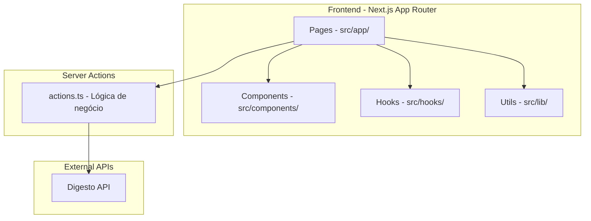
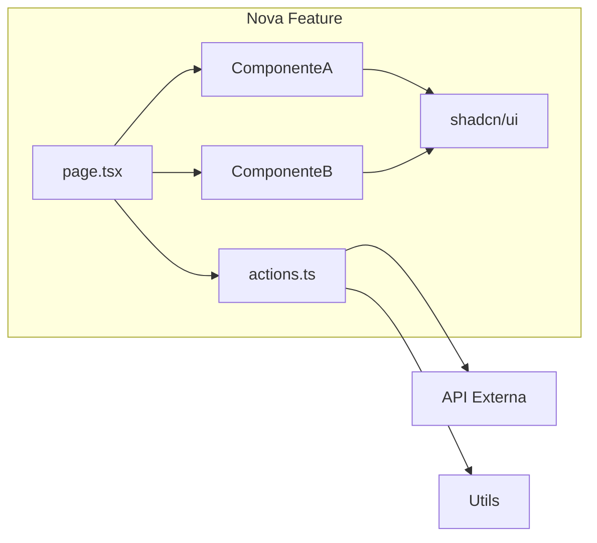
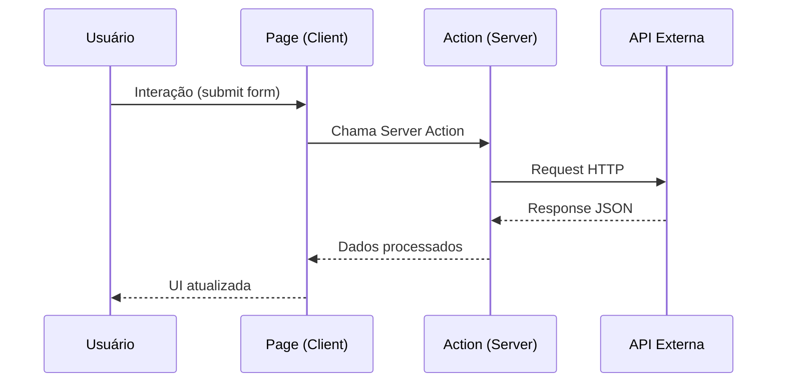
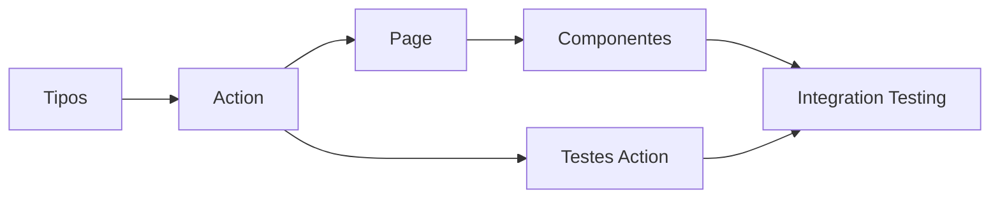

# 🏛️ Workflow: Desenvolver Plano de Arquitetura

Este workflow guia o processo de análise e planejamento arquitetural para novas funcionalidades ou refatorações significativas no B2Bhub.

---

## 📋 Quando Usar Este Workflow

Use este workflow quando:
- Implementar uma feature que afeta múltiplos módulos
- Integrar com novas APIs externas
- Refatorar estrutura de pastas ou componentes
- Introduzir novos padrões de design
- Planejar escalabilidade ou performance

---

## 🔍 Fase 1: Análise de Contexto

### 1.1 Entender a Arquitetura Atual
O B2Bhub segue a seguinte arquitetura:



### 1.2 Stack Tecnológica
| Camada | Tecnologia | Responsabilidade |
|--------|------------|------------------|
| Runtime | Bun | Execução e gerenciador de pacotes |
| Framework | Next.js 16 + App Router | Roteamento e Server Components |
| UI | React 19 + shadcn/ui | Componentes de interface |
| Styling | Tailwind CSS 4 | Estilização utility-first |
| Type Safety | TypeScript 5 | Tipagem estática |

### 1.3 Padrões Existentes
- **Server Actions**: Lógica de negócio isolada em `actions.ts`
- **Componentes Client**: Interatividade com `"use client"`
- **Utilitários**: Funções puras em `src/lib/`
- **Componentes UI**: shadcn/ui em `src/components/ui/`

---

## 📊 Fase 2: Levantamento de Requisitos

### 2.1 Template de Requisitos
```markdown
## Requisitos Funcionais
- [ ] RF01: [Descrição do requisito]
- [ ] RF02: [Descrição do requisito]

## Requisitos Não-Funcionais
- [ ] RNF01: [Performance, segurança, etc.]
- [ ] RNF02: [Descrição]

## Restrições
- [ ] REST01: [Limitações técnicas ou de negócio]

## Integrações
- [ ] INT01: [APIs ou serviços externos]
```

### 2.2 Perguntas Chave
- Qual problema estamos resolvendo?
- Quem são os usuários afetados?
- Quais são os fluxos principais?
- Existem dependências com outras features?
- Há requisitos de performance específicos?

---

## 🏗️ Fase 3: Design da Solução

### 3.1 Diagrama de Componentes
Desenhe a estrutura proposta:



### 3.2 Estrutura de Arquivos Proposta
```plaintext
src/app/nova-feature/
├── page.tsx              # Página principal
├── actions.ts            # Server Actions
├── actions.test.ts       # Testes
├── types.ts              # Tipos TypeScript (se complexos)
├── componente-a.tsx      # Componente específico
├── componente-b.tsx      # Componente específico
└── constants.ts          # Constantes da feature (se necessário)
```

### 3.3 Fluxo de Dados


---

## 📝 Fase 4: Definições Técnicas

### 4.1 Interfaces e Tipos
Defina os contratos de dados:

```typescript
// types.ts

// Input da action
export interface FeatureInput {
  field1: string;
  field2: number;
  options?: FeatureOptions;
}

// Options opcionais
export interface FeatureOptions {
  limit?: number;
  includeDetails?: boolean;
}

// Response esperado da API
export interface APIResponse {
  results: APIResult[];
  total: number;
  hasMore: boolean;
}

interface APIResult {
  id: string;
  data: string;
  // ...
}

// Output processado para o frontend
export interface FeatureOutput {
  items: ProcessedItem[];
  metadata: Metadata;
}
```

### 4.2 Tratamento de Erros
```typescript
// Tipos de erro
type FeatureError = 
  | { type: "VALIDATION_ERROR"; message: string }
  | { type: "API_ERROR"; statusCode: number }
  | { type: "NETWORK_ERROR"; details: string };

// Result pattern
type FeatureResult = 
  | { success: true; data: FeatureOutput }
  | { success: false; error: FeatureError };
```

### 4.3 Componentes Necessários
| Componente | Existente | Ação |
|------------|-----------|------|
| Card | ✅ | Usar de `@/components/ui/card` |
| Button | ✅ | Usar de `@/components/ui/button` |
| DataTable | ❌ | Adicionar via `npx shadcn@latest add table` |
| CustomChart | ❌ | Criar em `src/app/feature/chart.tsx` |

---

## 🔄 Fase 5: Plano de Implementação

### 5.1 Etapas Ordenadas
```markdown
### Sprint 1: Infraestrutura
- [ ] Criar estrutura de pastas
- [ ] Definir tipos e interfaces
- [ ] Implementar Server Action básica
- [ ] Criar testes para Server Action

### Sprint 2: UI
- [ ] Criar página principal
- [ ] Implementar formulário de entrada
- [ ] Adicionar componentes de resultado
- [ ] Integrar com action

### Sprint 3: Polish
- [ ] Adicionar estados de loading
- [ ] Implementar tratamento de erros na UI
- [ ] Adicionar à navegação
- [ ] Documentar feature
```

### 5.2 Dependências Entre Tarefas


---

## ⚠️ Fase 6: Análise de Riscos

### 6.1 Template de Riscos
| Risco | Probabilidade | Impacto | Mitigação |
|-------|---------------|---------|-----------|
| API instável | Média | Alto | Implementar retry e cache |
| Tipagem incorreta | Baixa | Médio | Validação runtime com Zod |
| Performance lenta | Média | Médio | Paginação e loading states |

### 6.2 Pontos de Atenção
- [ ] Variáveis de ambiente necessárias
- [ ] Rate limits da API externa
- [ ] Tamanho de payloads
- [ ] Compatibilidade mobile

---

## 📋 Fase 7: Documentação

### 7.1 Doc de Decisão Arquitetural (ADR)
```markdown
# ADR-XXX: [Título da Decisão]

## Status
Proposto | Aceito | Depreciado | Substituído

## Contexto
[Por que esta decisão é necessária]

## Decisão
[O que foi decidido]

## Consequências
### Positivas
- [Benefício 1]
- [Benefício 2]

### Negativas
- [Trade-off 1]
- [Trade-off 2]

## Alternativas Consideradas
1. [Alternativa A] - Descartada porque...
2. [Alternativa B] - Descartada porque...
```

### 7.2 Checklist Final do Plano
- [ ] Requisitos documentados
- [ ] Diagrama de componentes
- [ ] Estrutura de arquivos definida
- [ ] Tipos TypeScript especificados
- [ ] Fluxo de dados mapeado
- [ ] Riscos identificados
- [ ] Etapas de implementação ordenadas
- [ ] Dependências mapeadas

---

## 📚 Referências

- **Arquitetura Next.js App Router**: https://nextjs.org/docs/app
- **Patterns de Server Actions**: https://nextjs.org/docs/app/building-your-application/data-fetching/server-actions-and-mutations
- **Feature existente de referência**: `src/app/distribution/`
